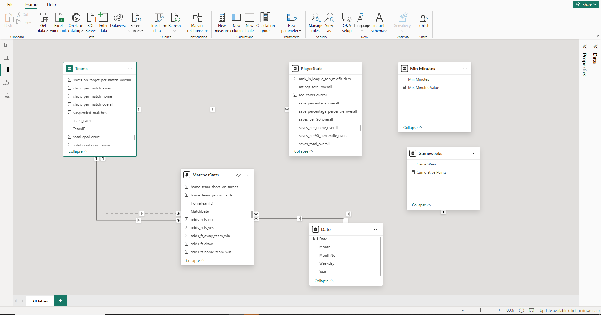
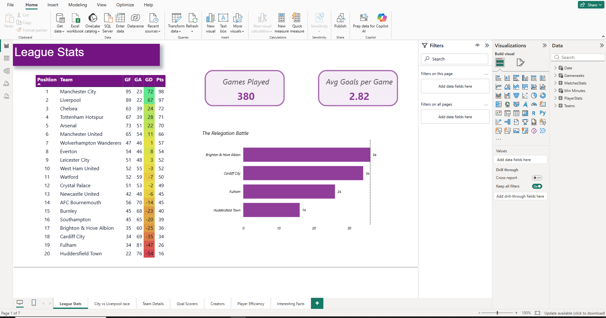
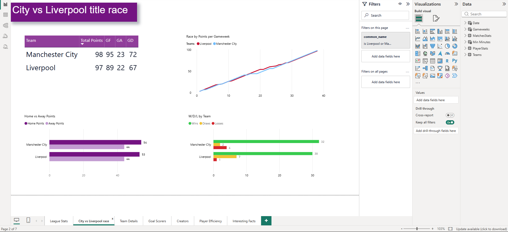
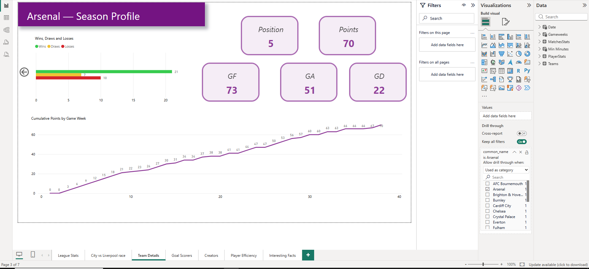
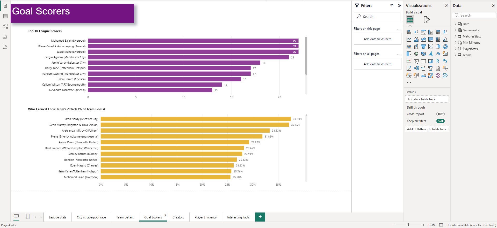
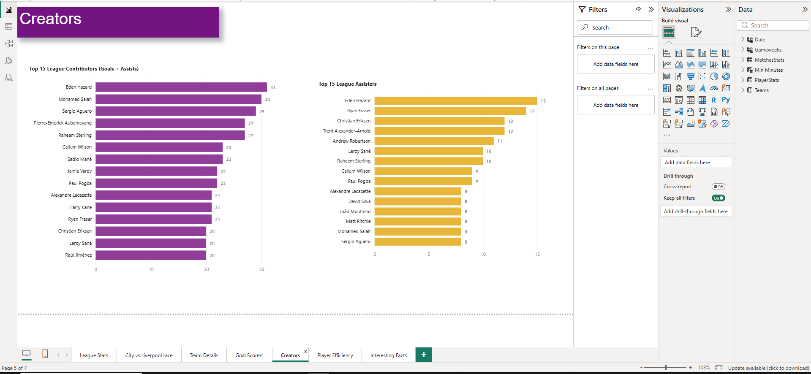
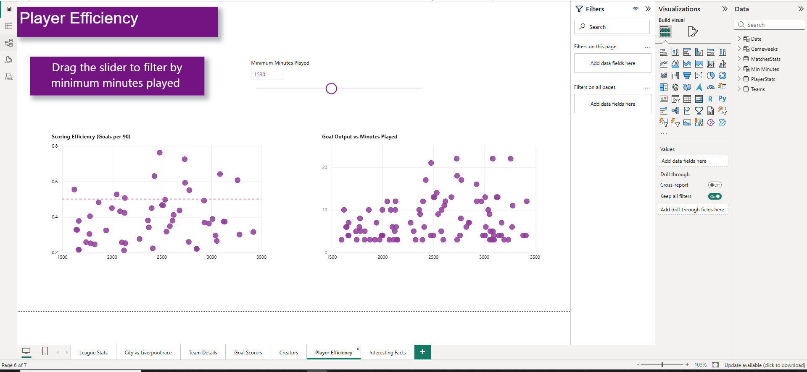
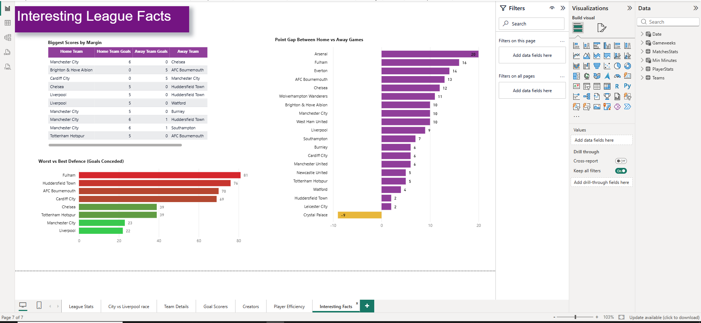

# Premier League 2018/19 Analysis — Power BI

An end-to-end Power BI analytics project exploring the 2018/19 Premier League season — from raw CSV data through data modelling, DAX, and an interactive multi-page report.

**Author:** Robert Ionita

---

## The Story

The 2018/19 title race came down to a single point: **Manchester City 98, Liverpool 97**. But the most interesting part isn't how close it was — it's *why* Liverpool fell short.

**Liverpool lost only one game all season and still finished second.**

The answer is in the draws. Liverpool drew 7 matches to City's 2 — five extra games where Liverpool took one point instead of three. Fewest losses in the league wasn't enough; converting draws into wins was what separated champion from runner-up. This report builds the case for that conclusion from the raw match data.

---

## Data Source

Free season CSVs from [FootyStats](https://footystats.org/download-stats-csv) — England Premier League, 2018/19:

- **Matches** — one row per match (teams, scores, date, gameweek, xG, attendance)
- **Players** — one row per player (goals, assists, minutes, club)
- **Teams** — team-level attributes

Standings, points, goal difference, form and all derived metrics are **calculated with DAX from the raw match results** — rather than using FootyStats' pre-computed columns — so that the measures recompute dynamically under any filter or time context (e.g. "points as of gameweek 30").

---

## Data Model

A multi-fact **star schema** with conformed dimensions:

**Fact tables**
- `MatchesStats` — one row per match (380 rows)
- `PlayerStats` — one row per player (572 rows)

**Dimensions**
- `Teams` — one row per team; built by merging two source team files on the common team name, with a surrogate `TeamID` key
- `Date` — a dedicated calendar table built with `CALENDAR` and marked as a date table
- `Gameweeks` — a small dimension (1–38) created so gameweek-based time analysis filters cleanly

**Role-playing dimension:** `Teams` connects to `MatchesStats` twice — once on `HomeTeamID` (active relationship) and once on `AwayTeamID` (inactive). DAX measures activate the away relationship with `USERELATIONSHIP` when needed, so every team's full home *and* away record is captured from a single dimension.

---

## Key DAX

A layered measure design — base measures referenced by name to build derived ones:

- **Points / Position** — points derived per match with `SUMX` + `SWITCH(TRUE(), …)`; league position via `RANKX`, with goal difference used as a tie-breaker so the table ranks exactly like a real league table
- **GF / GA / GD** — goals for, against and difference, each combining home and away halves through the role-playing relationships
- **Cumulative Points** — a running points total by gameweek (`CALCULATE` + `FILTER`), powering the title-race line chart
- **Goals per 90** — scoring rate normalised for minutes played (`DIVIDE`)
- **% of Team Goals** — each player's share of their club's goals, a percent-of-parent pattern using `ALL` + `SELECTEDVALUE`
- **Wins / Draws / Losses** — results breakdown, home and away

---

## Report Pages

1. **League Stats** — the full standings table (with conditional-formatted goal difference), league-wide headline cards, and the relegation battle
2. **City vs Liverpool** — the title race in detail: cumulative points run-in, head-to-head comparison, home/away splits, and the W/D/L breakdown that explains the one-point gap
3. **Team Detail** — a drill-through page with a dynamic title, giving any team's full profile and season points progression
4. **Goal Scorers** — top scorers and share-of-team-goals (who carried their team's attack)
5. **Creators** — top assisters and total goal involvements
6. **Player Efficiency** — scoring-efficiency scatters driven by an interactive *minimum-minutes* what-if parameter
7. **Interesting League Facts** — biggest wins, best/worst defences, and home/away performance gaps

### League Stats

### City vs Liverpool

### Team Detail

### Goal Scorers

### Creators

### Player Efficiency

### Interesting League Facts

---

## Analytical Findings

Beyond the headline, the report surfaces several findings that raw league-table numbers hide:

**The title was decided by draws, not losses.** Liverpool finished with the fewest defeats in the league (one) yet came second. City converted into wins the kind of games Liverpool drew — the five-draw difference (7 vs 2) is worth more than enough points to account for the one-point final gap.

**City won it at home.** Both teams took an identical 44 points on the road. The entire title margin traces to home form: City 54 home points, Liverpool 53. A single point, earned at the Etihad.

**Some strikers *were* their team's attack.** Measuring each player's share of their club's goals tells a different story than raw totals. Jamie Vardy (37.5%) and Glenn Murray (37.1%) carried the scoring load for mid-table and relegation-threatened sides — a level of dependency that top-scorer lists, dominated by players in high-scoring teams, completely obscure.

**Home advantage varied wildly between teams.** Comparing each team's home vs away points reveals who travelled well and who didn't. Arsenal were the most home-reliant side in the league (+20 points at home vs away) — a genuine weakness on the road. Crystal Palace were the only team in the division to earn *more* points away than at home.

**Finishing efficiency ≠ goal totals.** Normalising goals to a per-90 rate (with a minimum-minutes filter to exclude small samples) separates high-volume scorers who played every minute from efficient ones who produced in limited time — a distinction the top-scorers chart alone can't make.

---

## Key Design Decisions

- **Derived metrics over pre-computed columns.** The source files ship with ready-made standings and totals, but all standings, points, form and goal metrics are rebuilt with DAX — so they respond to filter and time context (needed for the gameweek-by-gameweek title-race chart) rather than being frozen season totals.
- **A dedicated Gameweeks dimension.** Gameweek started as a column inside the Matches fact table, which caused filter conflicts on the title-race chart (the team legend and the gameweek axis competed over the same fact table). Promoting gameweek to its own dimension gave it a clean, independent relationship into the facts and resolved the issue — a practical illustration of why slice-by fields belong in dimensions, not fact tables.
- **Value thresholds over fixed Top-N.** Where ties occur (e.g. three players sharing the Golden Boot on 22, several tied on goal count), fixed "Top 10" filters would silently drop tied records. Value thresholds (e.g. "margin ≥ 5", "goals ≥ 13") were used instead, so ties are handled honestly.
- **Colour that carries meaning.** Semantic colours (green = good, red = poor) are used only where a good/bad reading genuinely applies — goal difference, defensive records, win/draw/loss. Neutral categories use the theme palette, and a single accent colour flags true outliers, so colour communicates rather than decorates.

---

## Skills Demonstrated

- **Data preparation (Power Query):** CSV import, merges, surrogate keys, type handling, splitting/cleaning, connection-only queries
- **Data modelling:** multi-fact star schema, conformed dimensions, role-playing dimension, active/inactive relationships, a dedicated date table
- **DAX:** `CALCULATE`, `SUMX`, `RANKX`, `USERELATIONSHIP`, `SWITCH`, `ALL` / `ALLEXCEPT`, `SELECTEDVALUE`, `DIVIDE`, time intelligence (running totals), percent-of-parent patterns
- **Visualisation & interactivity:** slicers, drill-through, bookmarks, edit interactions, conditional formatting, what-if parameters, a consistent custom theme, and deliberate semantic colour use

---

## How to Use

Download `PL 2018 2019 season.pbix` and open it in **Power BI Desktop**. The report is fully interactive — use the slicers, drill through on teams, and drag the minimum-minutes slider on the Player Efficiency page.

---

*Built as a portfolio project and PL-300 (Power BI Data Analyst Associate) preparation.*
